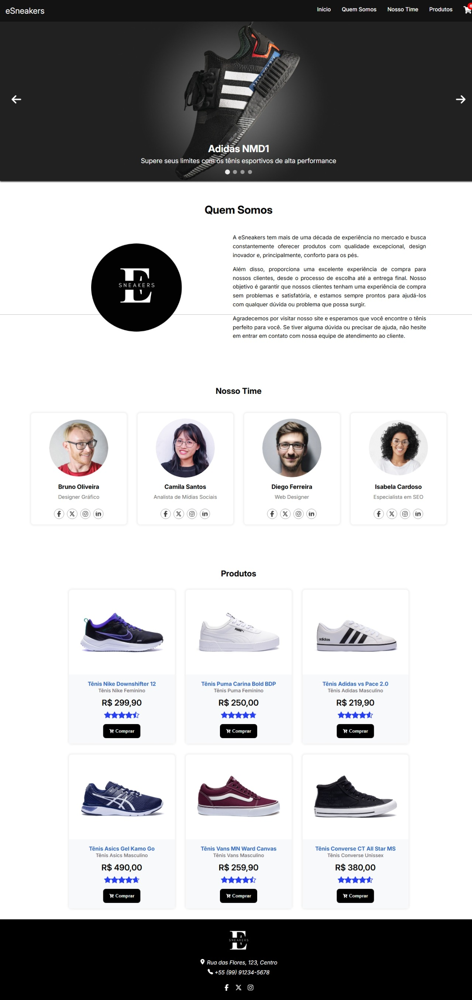
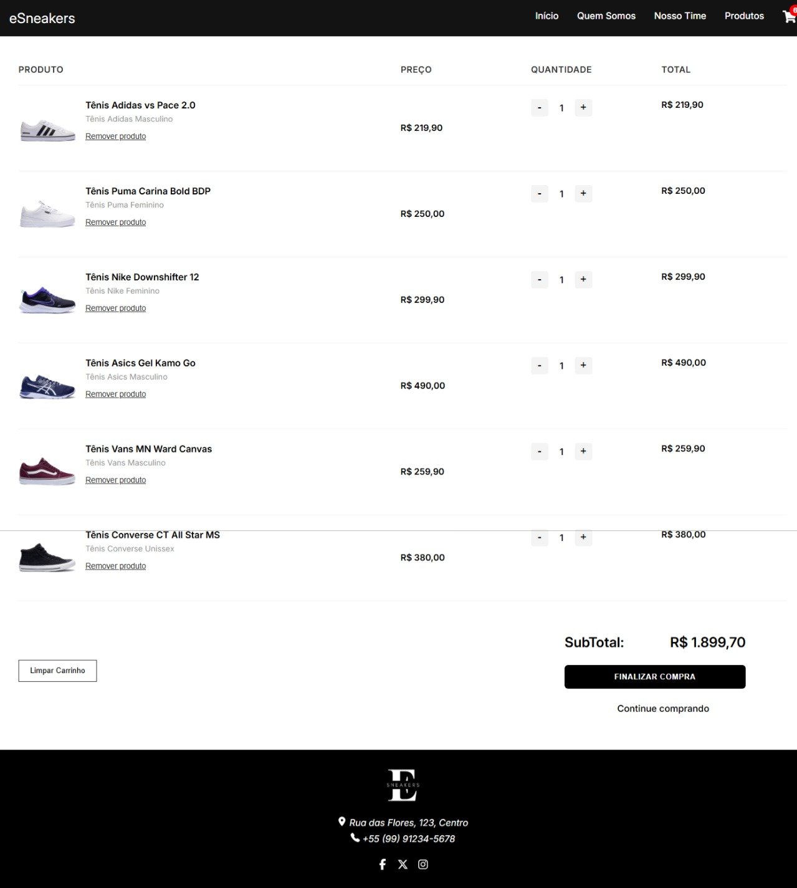

# 👟 eSneakers – Loja de Calçados Esportivos

Este projeto é uma loja virtual de calçados esportivos chamada **eSneakers**, desenvolvido como parte de um challenge do curso de **FrontEnd Development** da **Descomplica**. O principal objetivo foi aplicar conhecimentos de **React**, manipulação de estados com **Context API**, roteamento com **React Router**, estilização com **CSS modularizado**, e boas práticas de **componentização**.

## 🚀 Tecnologias Utilizadas

- **React.js**
- **React Router**
- **Context API**
- **JavaScript (ES6+)**
- **CSS (modularizado por componente)**
- **Vite**
- **Font**: Inter – importada via Google Fonts
- **React Icons**

## 📂 Estrutura de Componentes

### 🏠 Home
Renderiza os principais componentes da página inicial:

- **Carousel** – Carrossel com imagens e frases promocionais
- **AboutUs** – Seção com informações sobre a loja
- **OurTeam** – Apresenta os membros fictícios da equipe
- **Products** – Catálogo de produtos com botão de compra e avaliação

### 🎠 Carousel
Um carrossel funcional com setas de navegação e indicadores de slides. As imagens são carregadas dinamicamente usando `import.meta.glob`.

### 🧑‍💼 AboutUs
Apresenta um texto descritivo sobre a loja e uma imagem da logomarca.

### 🧑‍🤝‍🧑 OurTeam
Lista fictícia dos membros da equipe, com nome, profissão e ícones de redes sociais.

### 👟 Products
Exibe os produtos disponíveis para venda, com imagem, nome, descrição, preço, avaliação e botão de adicionar ao carrinho.

### 🛒 Funcionalidade de Carrinho
Utiliza o **CartContext** para armazenar os produtos adicionados ao carrinho. Os componentes **Cart**, **CartIcon** e a lógica associada permitem:

- Adição de produtos
- Remoção de itens
- Cálculo automático do total
- Exibição condicional do número de itens no ícone de carrinho

### 🧭 Navegação
A navegação é feita com **React Router**, e a navbar contém tanto um menu desktop quanto um menu responsivo lateral para dispositivos móveis.

Links do menu:
- Início
- Quem Somos
- Nosso Time
- Produtos

## 🧰 Utilitários

### 📁 utils/imageMap.js
Utiliza `import.meta.glob` para importar dinamicamente todas as imagens da pasta `assets/`. Isso permite o mapeamento de imagens para facilitar o uso em arrays como produtos, carousel, equipe, etc.

### 📊 Dados Fictícios
Todos os dados usados (produtos, slides do carrossel, membros da equipe, menu) estão organizados em um arquivo de dados centralizado (`data/data.js`) e importados conforme necessário.

## 🖼️ Imagens
As imagens utilizadas foram organizadas por pastas e associadas dinamicamente aos componentes através de um mapeamento:

- **produtos/** – Imagens dos tênis
- **carousel/** – Slides do carrossel
- **logo/** – Logos da marca
- **equipe/** – Membros da equipe

## 🎯 Funcionalidades

✅ Carrinho com persistência de estado

✅ Responsividade mobile e desktop

✅ Botão de "Finalizar compra" (estático para fins de demonstração)

✅ Design intuitivo

✅ Avaliação de produtos com estrelas (parcialmente preenchidas)

## 📜 Licença
Este projeto utiliza a **licença MIT**.

Os dados e imagens usados foram obtidos com fins exclusivamente educacionais. O desafio foi proposto pelo curso de **FrontEnd Development** da **Descomplica** em parceria com o banco **Nubank**.

## 🙏 Créditos
Projeto desenvolvido como parte do challenge do curso **FrontEnd Development** da Descomplica.
Design e layout inspirados em práticas modernas de e-commerce.  
Desenvolvido por **Ana Jessica**.

